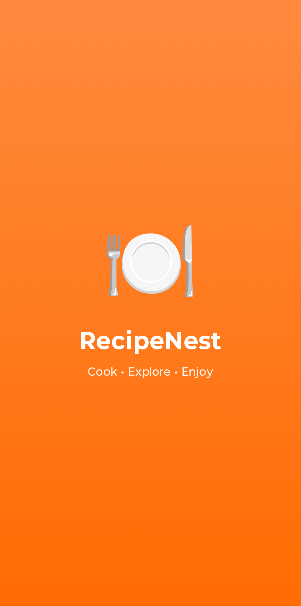
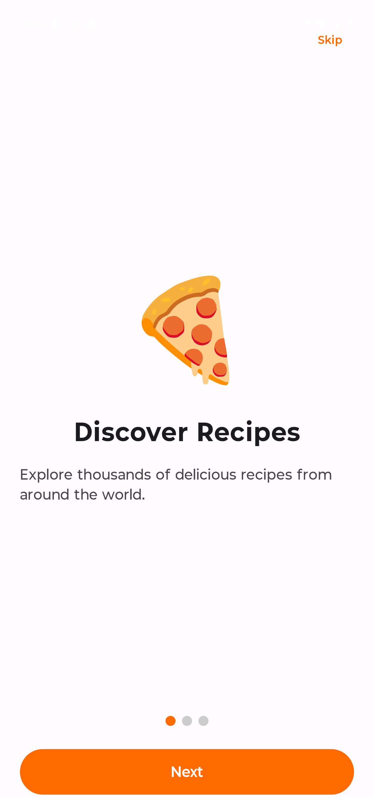
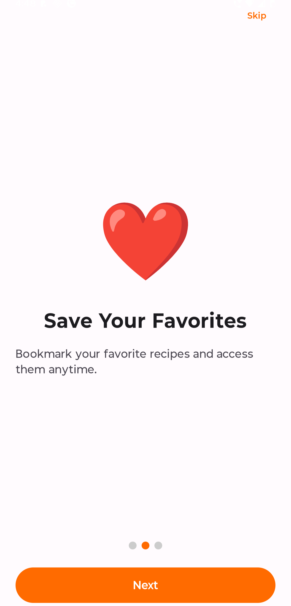
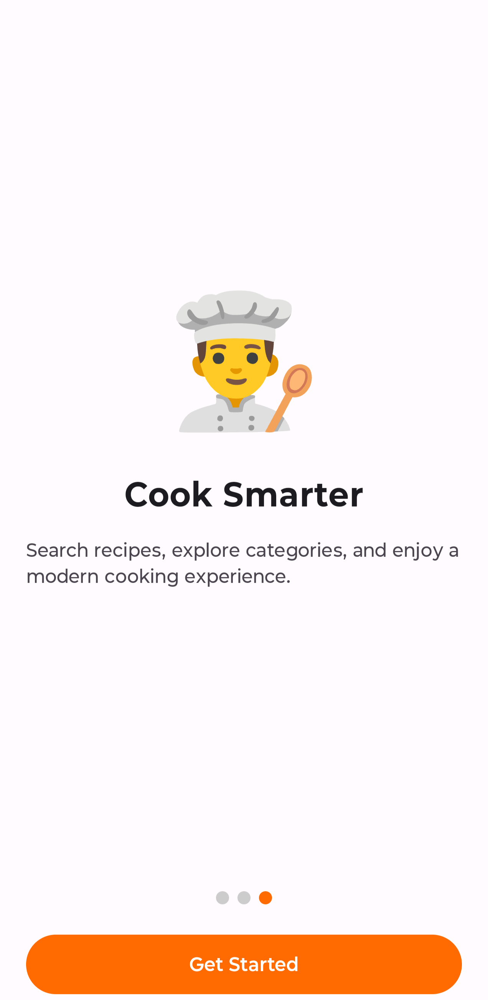
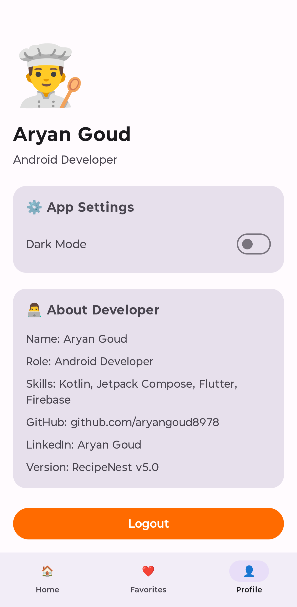

# 🍽️ RecipeNest – Premium Modern Android Recipe App

RecipeNest is a modern Android Recipe Application built using Kotlin and Jetpack Compose in Android Studio as part of the ApexPlanet Android App Development Internship – Task 5.

The app provides a beautiful and smooth user experience with real-time recipe data, modern UI design, onboarding experience, Firebase authentication, API integration, category filtering, persistent favorites, offline handling, settings management, notifications, dark mode support, and professional animations.

---

# ✨ Features

## 🚀 Core Features

- Splash Screen
- Modern Onboarding Screens
- Get Started Flow
- Login & Signup Authentication
- Persistent User Sessions
- Modern Jetpack Compose UI
- Bottom Navigation
- Real-Time Recipe API Integration
- Internet Recipe Images
- Search Functionality
- Recipe Detail Screen
- Favorites Screen
- Profile Screen
- Settings Screen
- Recently Viewed Recipes
- Push Notification UI
- Offline Internet Detection
- Dark Mode Support
- Responsive Layout
- Smooth Navigation Animations
- Pull-to-Refresh Support
- Interactive Favorite System
- Logout Functionality

---

## 🌐 API & Backend Features

- Retrofit API Integration
- JSON Parsing using Gson
- Real Recipe Fetching
- Dynamic Recipe Loading
- Search + Category Filtering
- Persistent Favorites
- Room Database Integration
- Firebase Authentication
- SharedPreferences Integration
- DataStore Preferences
- Real-Time Data Updates
- Offline Favorite Access
- API Error Handling
- Empty State UI
- Internet Connectivity Detection

---

## 🎨 UI/UX Features

- Premium Splash Screen
- Animated Onboarding Experience
- Smooth Page Indicators
- Modern Material 3 Design
- Featured Recipe Banner
- Category Filtering Chips
- Beautiful Recipe Cards
- Shimmer Loading Animation
- Smooth Screen Transitions
- Professional Typography & Spacing
- Responsive Compose Layouts
- Rounded Buttons & Cards
- Interactive UI Components
- Elegant Dark Mode Design
- Clean Bottom Navigation

---

## ❤️ Advanced Features

- Persistent Favorites using Room Database
- Offline Favorite Storage
- Real-Time Favorite Updates
- Animated Navigation Transitions
- Search + Category Combined Filtering
- DataStore Preferences
- Notification Support
- Recently Viewed Recipe Tracking
- Offline Internet Detection Screen
- Onboarding State Management
- User Session Persistence
- Dynamic Theme Switching

---

# 🛠️ Technologies Used

| Technology | Purpose |
|---|---|
| Kotlin | Programming Language |
| Jetpack Compose | Modern Android UI |
| Retrofit | API Integration |
| Gson Converter | JSON Parsing |
| Coil | Image Loading |
| Room Database | Local Storage |
| Firebase Authentication | User Authentication |
| DataStore | Preferences Storage |
| SharedPreferences | Onboarding State |
| Material 3 | UI Components |
| Coroutines | Asynchronous Programming |
| Navigation Compose | Screen Navigation |

---

# 🌐 API Used

## TheMealDB API

https://www.themealdb.com/api.php

### Used for:

- Fetching recipes
- Recipe images
- Recipe categories
- Recipe instructions
- Search functionality
- Dynamic recipe loading

---

# 📱 App Screenshots

## 🚀 Premium Splash Screen



---

## 👋 Onboarding Screens

### 🍕 Discover Recipes



### ❤️ Save Favorites



### 👨‍🍳 Cook Smarter



---

## 🔐 Login Screen


---

## 📝 Signup Screen


---

## 🏠 Home Screen


---

## 🍱 Online Recipes


---

## 🧩 Category Filtering


---

## 🔍 Search Functionality


---

## 📖 Recipe Detail Screen


---

## ❤️ Favorites Screen


---

## 🌙 Dark Mode


---

## 👤 Profile Screen


---

## 👨‍💻 About Developer Section



---

## ⚙️ Settings Screen


---

## 🕘 Recently Viewed Recipes


---

## 🔔 Notification UI


---

## 📴 Offline Internet Detection


---

## ⚠️ Empty State UI


---

# 📂 Project Structure

```bash
com.example.recipenest
│
├── api
│   ├── RecipeApiService.kt
│   ├── FavoriteRecipeDao.kt
│   ├── RecipeDatabase.kt
│   └── RetrofitInstance.kt
│
├── auth
│   ├── LoginScreen.kt
│   ├── SignupScreen.kt
│   ├── AuthViewModel.kt
│   └── FirebaseAuthManager.kt
│
├── onboarding
│   ├── OnboardingScreen.kt
│   ├── OnboardingItem.kt
│   └── OnboardingManager.kt
│
├── components
│   ├── CategoryChip.kt
│   ├── FeaturedBanner.kt
│   ├── OnlineRecipeCard.kt
│   ├── RecentRecipeCard.kt
│   ├── ShimmerRecipeCard.kt
│   ├── BottomNavigationBar.kt
│   ├── ThemeManager.kt
│   └── SettingsManager.kt
│
├── model
│   ├── OnlineRecipe.kt
│   ├── FavoriteRecipeEntity.kt
│   ├── RecentRecipe.kt
│   └── UserData.kt
│
├── screens
│   ├── SplashScreen.kt
│   ├── HomeScreen.kt
│   ├── FavoriteScreen.kt
│   ├── ProfileScreen.kt
│   ├── SettingsScreen.kt
│   ├── RecipeDetailScreen.kt
│   └── OfflineScreen.kt
│
├── navigation
│   ├── AppNavigation.kt
│   └── ScreenRoutes.kt
│
├── utils
│   ├── NetworkUtils.kt
│   ├── NotificationHelper.kt
│   ├── RecentRecipeManager.kt
│   ├── SettingsDataStore.kt
│   └── Constants.kt
│
└── MainActivity.kt
```

---

# 📦 Installation Guide

## Clone Repository

```bash
git clone https://github.com/aryangoud8978/RecipeNest-Task5.git
```

---

## Open in Android Studio

1. Open Android Studio
2. Click Open Project
3. Select RecipeNest Folder
4. Sync Gradle
5. Run App on Emulator or Device

---

# 🎯 Internship Task Features Covered

✅ Modern Android UI  
✅ API Integration  
✅ Firebase Authentication  
✅ Room Database Storage  
✅ State Management  
✅ Navigation System  
✅ Responsive Layouts  
✅ Persistent User Experience  
✅ Modern Compose Architecture  
✅ Advanced Jetpack Compose Concepts

---

# 👨‍💻 Developer

## Aryan Goud

💻 Android Developer  
🚀 Kotlin & Jetpack Compose Enthusiast  
📱 Flutter Developer  
🔥 Firebase Learner

### 🔗 GitHub

https://github.com/aryangoud8978

---

# ⭐ Final Result

RecipeNest is a complete premium modern Android recipe application that demonstrates:

✅ Professional Android Development  
✅ Modern UI/UX Principles  
✅ API Integration Skills  
✅ Firebase Authentication  
✅ Database Management  
✅ State Handling  
✅ Clean Architecture  
✅ Real-World App Development Concepts

---

# ❤️ Thank You

If you like this project, consider giving it a ⭐ on GitHub.